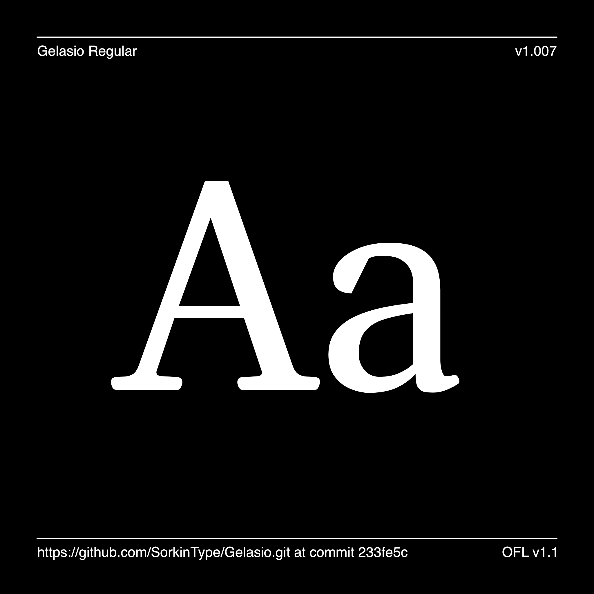

# Gelasio

[![][Fontbakery]](https://SorkinType.github.io/Gelasio/fontbakery/fontbakery-report.html)
[![][Universal]](https://SorkinType.github.io/Gelasio/fontbakery/fontbakery-report.html)
[![][GF Profile]](https://SorkinType.github.io/Gelasio/fontbakery/fontbakery-report.html)
[![][Outline Correctness]](https://SorkinType.github.io/Gelasio/fontbakery/fontbakery-report.html)
[![][Shaping]](https://SorkinType.github.io/Gelasio/fontbakery/fontbakery-report.html)

[Fontbakery]: https://img.shields.io/endpoint?url=https%3A%2F%2Fraw.githubusercontent.com%2FSorkinType%2FGelasio%2Fgh-pages%2Fbadges%2Foverall.json
[GF Profile]: https://img.shields.io/endpoint?url=https%3A%2F%2Fraw.githubusercontent.com%2FSorkinType%2FGelasio%2Fgh-pages%2Fbadges%2FGoogleFonts.json
[Outline Correctness]: https://img.shields.io/endpoint?url=https%3A%2F%2Fraw.githubusercontent.com%2FSorkinType%2FGelasio%2Fgh-pages%2Fbadges%2FOutlineCorrectnessChecks.json
[Shaping]: https://img.shields.io/endpoint?url=https%3A%2F%2Fraw.githubusercontent.com%2FSorkinType%2FGelasio%2Fgh-pages%2Fbadges%2FShapingChecks.json
[Universal]: https://img.shields.io/endpoint?url=https%3A%2F%2Fraw.githubusercontent.com%2FSorkinType%2FGelasio%2Fgh-pages%2Fbadges%2FUniversal.json

Gelasio is an original typeface which is metrics compatible with Georgia in its Regular, Bold, Italic and Bold Italic weights. Medium, Medium Italic, SemiBold and SemiBold Italic have now been added as well but these don't have equivalents in Georgia at the time of writing.

Notes:

• This design will retain the purpose of being metrics compatible with Georgia in Regular and Bold weights while expanding somewhat past what Georgia can do in some areas such as having case sensitive punctuation and a few more numbers styles.

• However to remain a fuctional match to Georgia, Gelasio will not include kerning.

• The new Georgia found in Windows 10 ( in 2018 ) has some features and glyphs not present in Gelasio such as support for Greek and Cyrillic, Small caps for all three scripts and some additional symbols, and box drawing glyphs. Later I hope to make Gelsio fully equivalent in these ways as well.

•  I also hope to make a font based on this work with a new name that is
 - not metrics compatible with Georgia
 - is a variable font
 - has kerning
 - is tuned to contemporary screen use rather than the relatively low resoution (72 dpi and 96 dpi) screens typical of mid-90s.

## About

The project is being made by Eben Sorkin @ Sorkin Type
Viviana Monsalve was also a contributor.
To contribute ideas and feedback, see [https://github.com/EbenSorkin/Gelasio](https://github.com/EbenSorkin/Gelasio)

## Languages

According to Hyperglot made by Rosetta Type Gelasio has base support for 339 of the 459 languages of Latin script. These include:

339 languages of Latin script:
------------------------------
Acheron, Achinese, Acholi, Achuar-Shiwiar, Afar, Afrikaans, Aguaruna, Ahtna, Alekano, Aleut, Amahuaca, Amarakaeri, Amis, Anaang, Andaandi, Dongolawi, Anuta, Ao Naga, Apinayé, Aragonese, Arbëreshë Albanian, Arvanitika Albanian, Asháninka, Ashéninka Perené, Asturian, Asu (Tanzania), Atayal, Balinese, Bari, Basque, Batak Dairi, Batak Karo, Batak Mandailing, Batak Simalungun, Batak Toba, Bemba (Zambia), Bena (Tanzania), Bikol, Bini, Bislama, Borana-Arsi-Guji Oromo, Bosnian, Breton, Buginese, Candoshi-Shapra, Caquinte, Caribbean Hindustani, Cashibo-Cacataibo, Cashinahua, Catalan, Cebuano, Central Aymara, Central Kurdish, Central Nahuatl, Chachi, Chamorro, Chavacano, Chiga, Chiltepec Chinantec, Chokwe, Chuukese, Cimbrian, Cofán, Congo Swahili, Cook Islands Māori, Cornish, Corsican, Creek, Crimean Tatar, Croatian, Czech, Danish, Dehu, Dimli, Dutch, Eastern Arrernte, Eastern Oromo, Efik, Embu, English, Ese Ejja, Falam Chin, Faroese, Fijian, Filipino, Finnish, French, Friulian, Gagauz, Galician, Ganda, Garifuna, Ga’anda, German, Gheg Albanian, Gilbertese, Gooniyandi, Gourmanchéma, Guadeloupean Creole French, Gusii, Gwichʼin, Haitian, Hakha Chin, Hani, Hawaiian, Hiligaynon, Ho-Chunk, Hopi, Huastec, Hungarian, Icelandic, Igbo, Iloko, Inari Sami, Indonesian, Irish, Istro Romanian, Italian, Ixcatlán Mazatec, Jamaican Creole English, Japanese, Javanese, Jola-Fonyi, K'iche', Kabuverdianu, Kaingang, Kala Lagaw Ya, Kalaallisut, Kalenjin, Kamba (Kenya), Kaonde, Kaqchikel, Karelian, Kashubian, Kekchí, Kenzi, Mattokki, Khasi, Kikuyu, Kimbundu, Kinyarwanda, Kirmanjki, Kituba (DRC), Kongo, Konzo, Kuanyama, Kven Finnish, Kölsch, Ladin, Ladino, Latgalian, Ligurian, Lithuanian, Lombard, Low German, Lower Sorbian, Lozi, Luba-Lulua, Lule Sami, Luo (Kenya and Tanzania), Luxembourgish, Macedo-Romanian, Madurese, Makhuwa, Makhuwa-Meetto, Makonde, Makwe, Malagasy, Malaysian, Maltese, Mandinka, Mandjak, Mankanya, Manx, Maore Comorian, Maori, Mapudungun, Marshallese, Matsés, Mauritian Creole, Meriam Mir, Meru, Mezquital Otomi, Minangkabau, Mirandese, Mizo, Mohawk, Montenegrin, Munsee, Murrinh-Patha, Muslim Tat, Mwani, Mískito, Naga Pidgin, Navajo, Ndonga, Neapolitan, Ngazidja Comorian, Niuean, Nobiin, Nomatsiguenga, North Azerbaijani, North Marquesan, North Ndebele, Northern Kurdish, Northern Qiandong Miao, Northern Sami, Northern Uzbek, Norwegian, Nyanja, Nyankole, Occitan, Ojitlán Chinantec, Orma, Oroqen, Otuho, Palauan, Paluan, Pampanga, Papantla Totonac, Papiamento, Paraguayan Guaraní, Pedi, Picard, Pichis Ashéninka, Piemontese, Pijin, Pintupi-Luritja, Pipil, Pite Sami, Pohnpeian, Polish, Portuguese, Potawatomi, Purepecha, Páez, Quechua, Romanian, Romansh, Rotokas, Rundi, Rwa, Samburu, Samoan, Sango, Sangu (Tanzania), Saramaccan, Sardinian, Scottish Gaelic, Secoya, Sena, Seri, Seselwa Creole French, Shambala, Shawnee, Shipibo-Conibo, Shona, Shuar, Sicilian, Silesian, Slovak, Slovenian, Soga, Somali, Soninke, South Azerbaijani, South Marquesan, South Ndebele, Southern Aymara, Southern Qiandong Miao, Southern Sami, Southern Sotho, Spanish, Sranan Tongo, Standard Estonian, Standard Latvian, Standard Malay, Sundanese, Swahili, Swati, Swedish, Swiss German, Tagalog, Tahitian, Taita, Talysh, Tedim Chin, Tetum, Tetun Dili, Tiv, Toba, Tok Pisin, Tokelau, Tonga (Tonga Islands), Tonga (Zambia), Tosk Albanian, Totontepec Mixe, Tsakhur, Tsonga, Tswana, Tumbuka, Turkish, Turkmen, Tzeltal, Tzotzil, Uab Meto, Umbundu, Ume Sami, Upper Guinea Crioulo, Upper Sorbian, Venetian, Veps, Vietnamese, Võro, Wallisian, Walloon, Walser, Wangaaybuwan-Ngiyambaa, Waorani, Waray (Philippines), Warlpiri, Wayuu, Welsh, West Central Oromo, Western Abnaki, Western Frisian, Wik-Mungkan, Wiradjuri, Wolof, Xavánte, Xhosa, Yanesha', Yao, Yapese, Yindjibarndi, Yoruba, Yucateco, Zapotec, Zulu, Zuni, Záparo

339 languages supported in total.

## Building

Fonts are built automatically by GitHub Actions - take a look in the "Actions" tab for the latest build.

If you want to build fonts manually on your own computer:

* `make build` will produce font files.
* `make test` will run [FontBakery](https://github.com/googlefonts/fontbakery)'s quality assurance tests.
* `make proof` will generate HTML proof files.

The proof files and QA tests are also available automatically via GitHub Actions - look at https://SorkinType.github.io/Gelasio.

## Changelog

When you update your font (new version or new release), please report all notable changes here, with a date.
[Font Versioning](https://github.com/googlefonts/gf-docs/tree/main/Spec#font-versioning) is based on semver. 
Changelog example:

**10 October 2023. Version 1.008**

- MAJOR Font turned to a variable font.
- SIGNIFICANT New Language support.

## License

This Font Software is licensed under the SIL Open Font License, Version 1.1.
This license is available with a FAQ at
https://scripts.sil.org/OFL

## Repository Layout

This font repository structure is inspired by [Unified Font Repository v0.3](https://github.com/unified-font-repository/Unified-Font-Repository), modified for the Google Fonts workflow.
